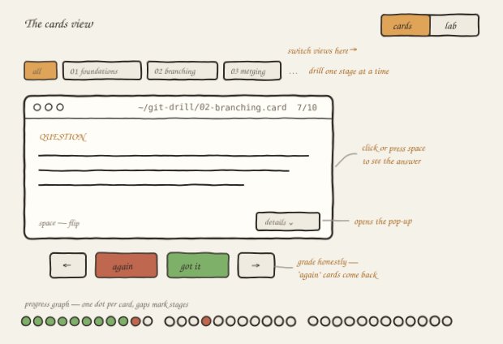
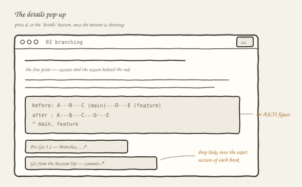
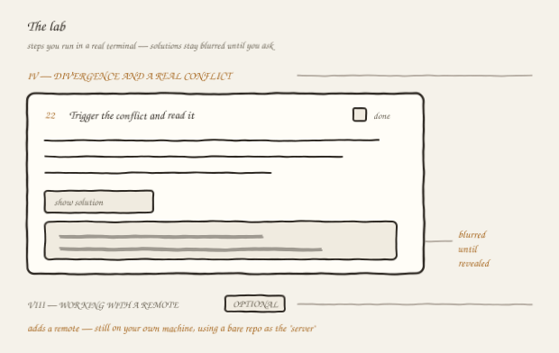
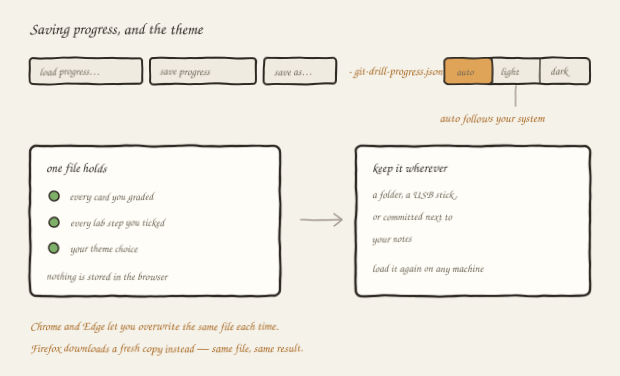
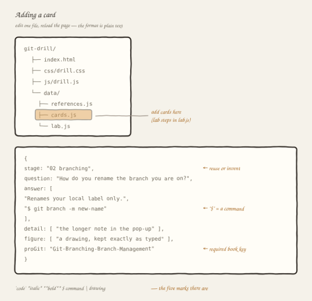

# git drill

A flashcard deck and a hands-on lab for learning git, in one page that runs
straight from your file system. No install, no build step, no server, no
account anywhere.

- **A deck of flashcards**, grouped into stages that run from your first `init`
  to force-push discipline
- **A multi-step lab** you actually run in a terminal, against a real repository
- Every card links into the exact section of *Pro Git* and, where it goes
  deeper, of Wiegley's *Git from the Bottom Up*

---

## Start in thirty seconds

```bash
git clone <this-repo-url>
cd git-drill
```

Then open `index.html` — double-click it, or drag it into a browser window.
That is the whole setup. No install, no build, no server. Nothing is written to
your machine unless you explicitly save your progress to a file.

If you would rather not clone, use **Code → Download ZIP** on GitHub and unzip
it. Either way you need the whole folder: `index.html` loads the stylesheet and
the three data files from the directories beside it, so that one file on its
own shows a blank page.

To give the whole team a link instead, turn on GitHub Pages for this repository
(*Settings → Pages → deploy from the `main` branch*) and share the URL. Nobody
downloads anything.

Works in Chrome, Edge and Firefox. Safari works too, with one small caveat
noted under [Saving progress](#saving-progress).

---

## The two views

A switch in the top right moves between them.

### Cards



Read the question, answer it in your head, then flip the card and grade
yourself honestly. Cards you mark **again** come back for a second pass at the
end; cards you mark **got it** do not.

Two filters sit above the card and compose with each other. The **keyword box**
keeps any card containing at least one of your terms, so `rebase stash` shows
cards about either — useful when you know the word but not the stage. The
**stage chips** narrow to one lane, so you can drill just merging, or just the
undo family. Use them together to search within a stage; the count beside the
box tells you how many cards survived.

The row of dots at the bottom is one node per card — green for solid, rust for
revisit, amber ring for where you are. It follows the filters, so it always
shows the set you are actually working through. Click any dot to jump there.

**Keyboard**

| key | does |
|---|---|
| `space` | flip the card |
| `←` `→` | previous / next |
| `g` | grade "got it" |
| `a` | grade "again" |
| `d` | open the details pop-up |
| `/` | jump to the keyword box (`esc` clears it) |
| `s` | shuffle the deck |
| `t` | cycle the theme |
| `⌘/ctrl-s` | save progress |

### The details pop-up



Once a card is flipped, a **details** button appears. It opens the fine print:
a paragraph that goes past the answer into caveats and reasons, an ASCII figure
where a picture helps, and links straight into the relevant section of each
book rather than to the chapter index.

### Lab



A multi-step exercise in a real terminal, against a real directory on your
machine. Each step states a requirement rather than handing you a command, so
you have to know the tool to get there. The solution sits underneath, blurred and
unselectable, until you press **show solution** — or click the blurred block
itself.

Acts I–VI build a repository from nothing and stay entirely local: no remote,
no clone, no push. Act VII is **optional** and adds a remote, but still on your
own machine — it has you create a bare repository next door to act as the
"server", so you can practise `push`, `pull`, tracking branches,
`--force-with-lease` and pruning without an account anywhere.

Everything the lab creates lives in two or three directories you delete at the
end. The last step of each act tells you how.

You need git and a shell: Terminal on macOS or Linux, **Git Bash** on Windows.

---

## Saving progress



Nothing is stored in your browser. Progress lives in a single JSON file that
you keep wherever you like — a folder, a USB stick, or committed next to your
own notes. One file holds every card you graded, every lab step you ticked, and
your theme choice.

- **save progress** — writes to the file you last chose, or asks for one
- **save as…** — appears once a file is bound, and picks a different one
- **load progress…** — reads a file back and puts you at your first ungraded card

In Chrome and Edge, saving overwrites the same file every time. Firefox and
Safari do not yet support the browser API that allows that, so they download a
fresh copy instead — the result is the same file, you just choose where it
lands.

The file is keyed by the *content* of each card and step, not by their
positions, so it keeps working after the deck is edited or reordered. Anything
that no longer matches is reported as unmatched rather than dropped silently.

## Themes

Three settings: **auto**, **light**, **dark**. Auto follows your operating
system, so a machine that switches at sunset switches the page with it. Press
`t` to cycle. The choice travels in your progress file.

---

---

## Example aliases and settings

`examples/gitconfig` collects the aliases and settings the cards keep pointing
at, ready to paste. Open your own config with `git config --global --edit` and
take whichever parts you want — every line is commented with what it does and
why.

The handful worth having on day one:

```ini
[alias]
    lg  = log --all --oneline --graph --decorate   # the graph, every branch
    lgb = log --oneline --graph --decorate         # ...this branch only
    s   = status -sb                               # status without the tutorial
    staged = diff --cached                         # what you are about to commit
    fixit  = commit --amend --no-edit              # fold a forgotten file in

[pull]
    rebase = true          # replay your commits instead of a merge commit
[rerere]
    enabled = true         # remember how you resolved a conflict, replay it
[fetch]
    prune = true           # forget remote branches that no longer exist
[push]
    autoSetupRemote = true # a new branch pushes without needing -u (git 2.37+)
```

`rerere` and `push.autoSetupRemote` are the two that quietly remove the most
friction, and neither has a downside worth weighing.

The file also carries a guarded `nuke` alias that asks before discarding
uncommitted work, and a commented submodule block to uncomment if you need it.

## Contributing

The whole point of the layout is that adding content never means touching the
engine.

```
git-drill/
├── index.html          the page — markup only
├── css/drill.css       every style, in ten commented sections
├── js/drill.js         the engine — you should not need to edit this
├── data/
│   ├── references.js   the two books, and the sections cards can link to
│   ├── cards.js        the flashcards        ← add cards here
│   └── lab.js          the lab steps         ← add steps here
│                       all three are plain lists of text, see below
├── examples/gitconfig  the aliases and settings the cards refer to
├── tools/check.js      verifies a change without opening a browser
└── docs/               the sketches in this README
```

### Adding a card



Open `data/cards.js`, find the stage you want, and copy an existing card. No web
development needed — a card is a block of plain text:

```js
{
  stage:    "02 branching",
  question: "How do you rename the branch you are on?",
  answer: [
    "Renames your local label only.",
    "$ git branch -m new-name",
    "| before:  old-name",
    "| after :  new-name"
  ],
  detail: [
    "A branch already pushed needs the remote told separately: delete the old",
    "name there and push the new one."
  ],
  figure: [
    "before:  old-name",
    "after :  new-name"
  ],
  proGit:   "Git-Branching-Branch-Management",
  bottomUp: "the-beauty-of-commits"
},
```

Every line goes in `"double quotes"`, separated by commas. Four marks work in
`question`, `answer`, `detail` and lab tasks:

| you write | you get |
|---|---|
| `` `git status` `` | code, in the accent colour |
| `*text*` | *italic* |
| `**text**` | **bold** |
| `$ git status` | a terminal block |
| `\| A ── B ── C` | a small drawing, shown exactly as typed |

Several `$` or `|` lines in a row each become one block, so a two-command answer
is two lines and a four-line diagram is four. Everything else is plain text —
write `<` and `&` normally and ignore HTML entirely.

A `|` drawing appears on the card itself; the separate `figure` field appears in
the details pop-up. Use the first for the shape of the thing, the second for the
fuller version.

Reuse an existing `stage` to add to that stage. Write a new one and a new stage
appears by itself, with its own filter chip and its own gap in the progress
graph — nothing to register anywhere.

`proGit` is required and `bottomUp` optional; both are keys into
`data/references.js`. If the section you want is not listed there, add it there
first.

Reload the page when you are done. **Open the browser console** (F12): every
load checks the data and reports problems in plain language, naming the file and
the card —

```
git drill found 2 problem(s) in the data files:
  cards.js, card 47 (05 conflicts): "detail" should be a list of lines in [ ]
  cards.js, card 47 (05 conflicts): "Git-Basics-Typo" is not in references.js
```

A blank page almost always means a missing comma or quote; the console names the
line.

### Adding a lab step

Same shape, in `data/lab.js`:

```js
{
  title: "Delete the merged branch",
  task: [
    "Remove the branch label using the form that refuses to delete unmerged",
    "work. Confirm the commits survived it."
  ],
  solution: [
    "git branch -d feature/queue",
    "git branch              # only main remains"
  ]
},
```

Write tasks as requirements rather than commands — the reader should have to
know the tool to get there. `solution` lines are shown exactly as typed, so
comments and indentation line up.

Act dividers are entries with an `act` instead of a task, and `optional: true`
gives the act its OPTIONAL badge:

```js
{ act: "IV — divergence and a real conflict" },
{ act: "VII — optional: working with a remote", optional: true },
```

Steps are numbered automatically, so inserting one renumbers the rest. One thing
to know: a reader's ticked steps are remembered by the step *title*, so
reordering is free but **renaming** one loses its tick in progress files people
have already saved.

### Checking a change

```bash
node tools/check.js
```

No framework and nothing to install. It boots the engine against a stand-in for
the browser and checks the data files, the four text marks, both filters, view
switching and the save/load round trip. Exit code 1 if anything fails.

For anything visual — layout, themes, the blur on lab solutions — open the page.

### House style for cards

Worth keeping consistent, since a deck that reads in two voices is harder to
drill:

- Ask one thing per card. If the answer needs "and", it is two cards.
- Phrase questions as tasks or as failures you actually meet — "you rebased and
  push is rejected, why" beats "what does `--force-with-lease` do".
- The answer is the short version; the pop-up is where the nuance goes.
- Figures earn their place by showing a shape — a graph, a before-and-after, a
  table of what each flag touches. Not by restating the answer.

Write cards in your own words. Cards *link* to Pro Git and to Git from the
Bottom Up, and linking carries no obligation, but copying does: Pro Git is
CC BY-NC-SA, which cannot be redistributed under this repository's MIT licence,
so neither its prose nor its diagrams can be adapted into a card. Wiegley's
CC BY 4.0 is more relaxed and would allow it with credit — but its attribution
duty would then outlive the MIT notice and follow every fork, so the tidier
habit is to describe what git does and draw the shape yourself.

---

## Notes for the curious

The data files are `.js` rather than `.json` for one reason: browsers refuse to
`fetch` a file from your own disk, so a JSON version would only work behind a
web server. Keeping them as scripts means double-clicking `index.html` works.
The contents are still just lists of text — no programming involved.
That is also why there is no bundler, no `package.json` and no build step at
all: what is in the repository is what runs in the browser. Edit a file, reload
the page.

If you would rather serve it — for a team-wide link, say — anything static will
do:

```bash
python3 -m http.server 8000     # then open http://localhost:8000
```

`js/drill.js` is organised into eleven commented sections; the header block
lists them. Content and presentation are fully separated, so the engine has no
knowledge of any particular card, stage or step.

---

## Credits

The two books every card points at, both freely readable online and both worth
your time:

- **Pro Git**, Chacon & Straub — <https://git-scm.com/book/en/v2>
- **Git from the Bottom Up**, John Wiegley — <https://jwiegley.github.io/git-from-the-bottom-up/>

The deck is not a substitute for either. It is a way of finding out which parts
you have actually retained. Cards link to a section of one or both books; that
is a bibliography, and no text or figure from either is reproduced here.

---

## License

MIT — see [LICENSE](LICENSE). Use it, change it, teach from it, fork it into
something better, commercially or otherwise; the one condition is that the
copyright notice travels with the copy.
